<!--
╔══════════════════════════════════════════════════════════════════╗
║             K E E R ' S   M I N E C R A F T   C A F É           ║
║         A GitHub profile that exists inside a pixel world.       ║
╚══════════════════════════════════════════════════════════════════╝
  Welcome, traveller. Grab a coffee and look around.
-->

<div align="center">

<!-- ═══════════════════════════════════════════════════ -->
<!--                  ☕  H E R O                        -->
<!-- ═══════════════════════════════════════════════════ -->

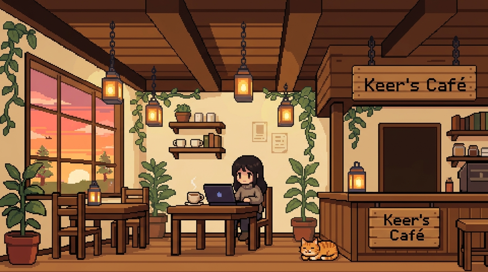

<br/>


<br/>

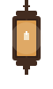
&nbsp;&nbsp;&nbsp;
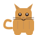
&nbsp;&nbsp;&nbsp;

<br/>

<p>
  <kbd>☕ <a href="#about">About</a></kbd>
  &nbsp;·&nbsp;
  <kbd>🪟 <a href="#things-i-love">Things I Love</a></kbd>
  &nbsp;·&nbsp;
  <kbd>🫙 <a href="#learned">Learned</a></kbd>
  &nbsp;·&nbsp;
  <kbd>🧰 <a href="#toolbox">Toolbox</a></kbd>
  &nbsp;·&nbsp;
  <kbd>⭐ <a href="#featured">Featured</a></kbd>
  &nbsp;·&nbsp;
  <kbd>📓 <a href="#journal">Journal</a></kbd>
  &nbsp;·&nbsp;
  <kbd>✉️ <a href="#contact">Contact</a></kbd>
</p>

</div>

<br/>

<div align="center">
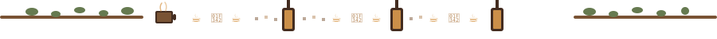
</div>

<br/>

<!-- ═══════════════════════════════════════════════════ -->
<!--            📖  A B O U T   M E                     -->
<!-- ═══════════════════════════════════════════════════ -->

<div align="center" id="about">

<h2>📖 &nbsp; About Me</h2>

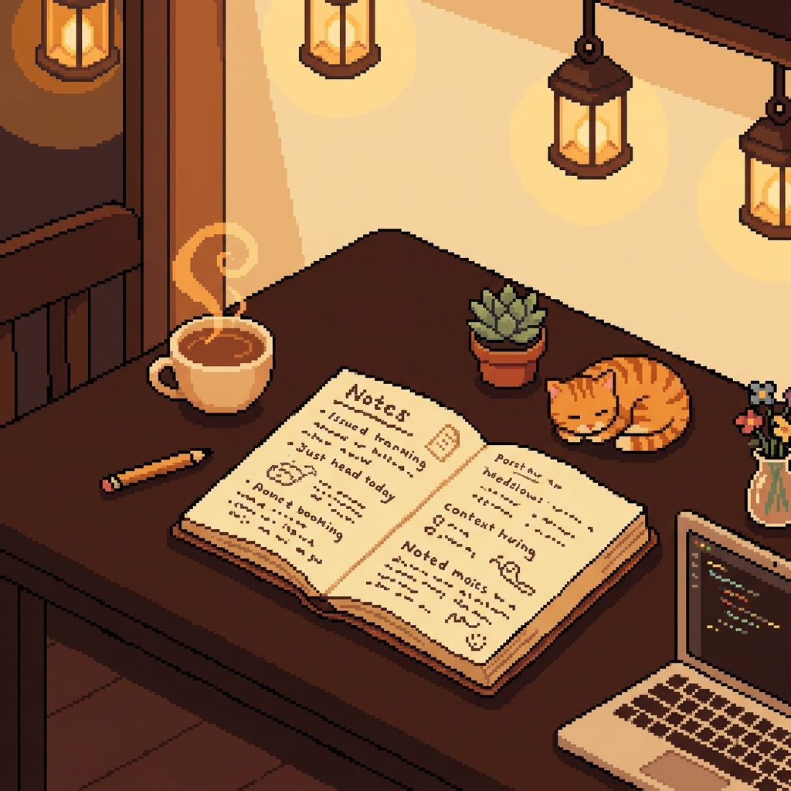

<br/><br/>

<table>
<tr>
<td align="center" width="100%">


<br/><br/>

```
I'm Keer — an aspiring software engineer figuring out
how things work, building random stuff, learning constantly,
and occasionally pretending I know what I'm doing.

Come in, grab a coffee, and see what I'm building. ☕
```

</td>
</tr>
</table>

<br/>


</div>

<br/>

<div align="center">

</div>

<br/>

<!-- ═══════════════════════════════════════════════════ -->
<!--         🪟  T H I N G S   I   L O V E              -->
<!-- ═══════════════════════════════════════════════════ -->

<div align="center" id="things-i-love">

<h2>🪟 &nbsp; Things I Love</h2>

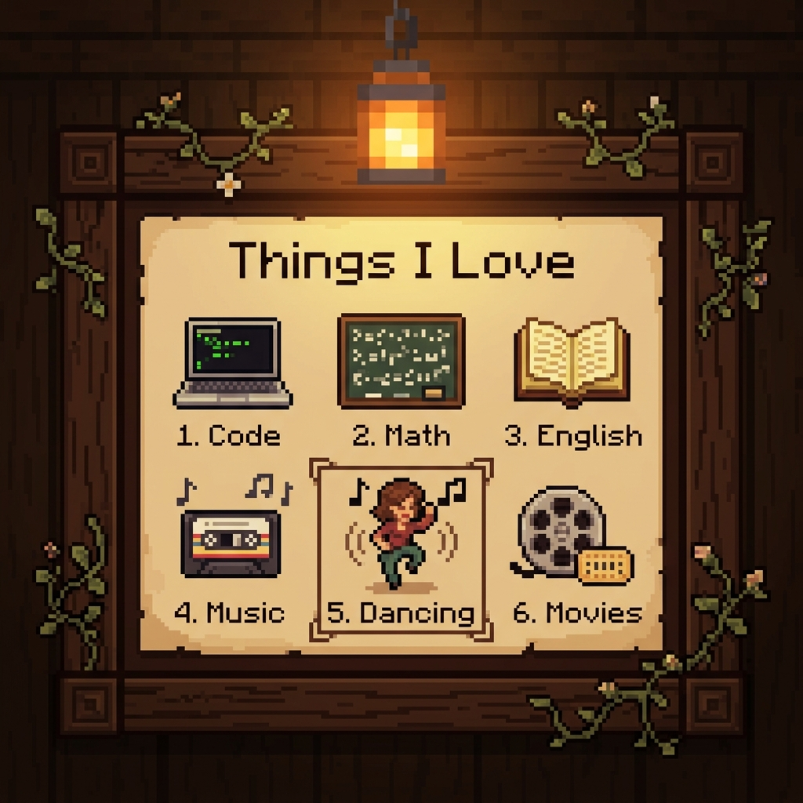

<br/><br/>

<details>
<summary><b>🎵 tap to read more about what I love</b></summary>
<br/>

| 💻 Code | ✏️ Math | 📖 English |
|:---:|:---:|:---:|
| Laptops, terminals, late-night builds | Equations that click, patterns, geometry | Books, words, the way language works |

| 🎵 Music | 💃 **Dancing** | 🎬 Movies |
|:---:|:---:|:---:|
| Cassettes, good playlists, vibes | **Movement, rhythm, my favourite thing** | Film reels, stories told in light |

</details>

</div>

<br/>

<div align="center">

</div>

<br/>

<!-- ═══════════════════════════════════════════════════ -->
<!--      🫙  W H A T   I ' V E   L E A R N E D        -->
<!-- ═══════════════════════════════════════════════════ -->

<div align="center" id="learned">

<h2>🫙 &nbsp; Things I've Learned ☕</h2>

<p><i>Labelled jars on the cafe shelf — things I've actually worked with.</i></p>

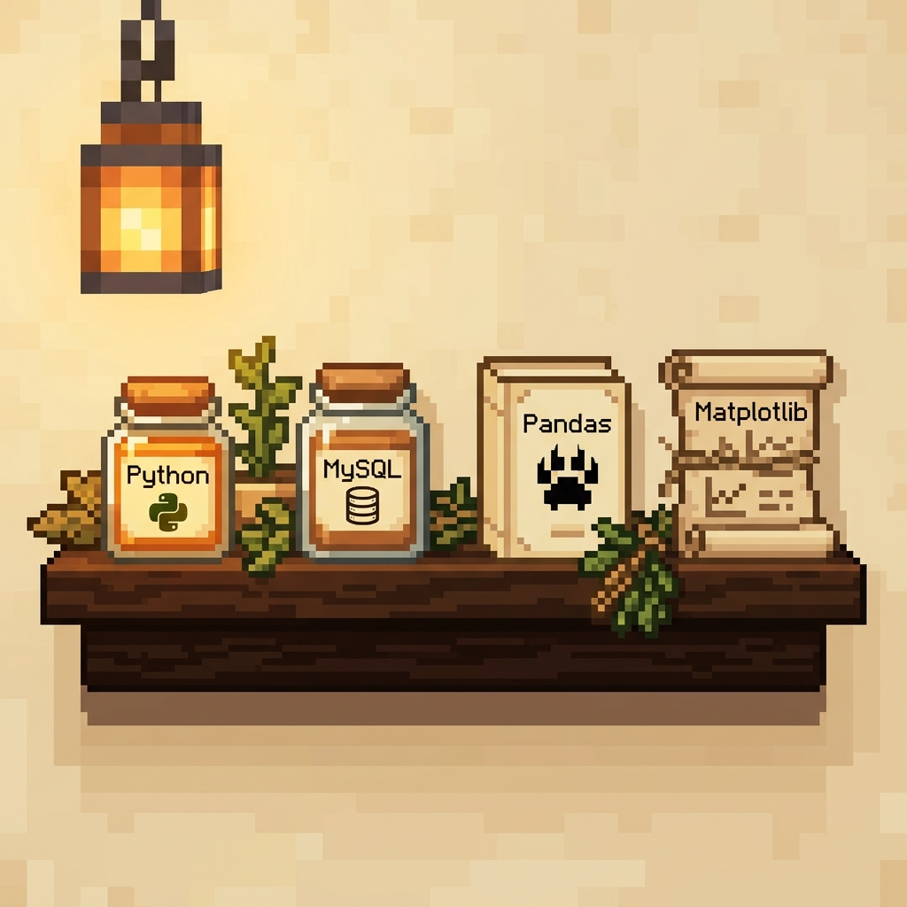

<br/><br/>

<table>
<tr>
<td align="center" width="25%">
<b>🐍 Python</b><br/>
<sub>My go-to language.<br/>I've built things, broken things,<br/>and learned a lot.</sub>
</td>
<td align="center" width="25%">
<b>🗄️ MySQL</b><br/>
<sub>Tables, queries, joins.<br/>Data storage that<br/>actually makes sense.</sub>
</td>
<td align="center" width="25%">
<b>🐼 Pandas</b><br/>
<sub>Wrangling data frames,<br/>cleaning messy datasets,<br/>finding patterns.</sub>
</td>
<td align="center" width="25%">
<b>📈 Matplotlib</b><br/>
<sub>Turning numbers into<br/>charts that tell a story.<br/>Visual data.</sub>
</td>
</tr>
</table>

</div>

<br/>

<div align="center">

</div>

<br/>

<!-- ═══════════════════════════════════════════════════ -->
<!--    🫖  C U R R E N T L Y   B R E W I N G           -->
<!-- ═══════════════════════════════════════════════════ -->

<div align="center" id="brewing">

<h2>🫖 &nbsp; Currently Brewing... ☕</h2>

<p><i>These are on the stove. Still steaming. Watch this space.</i></p>

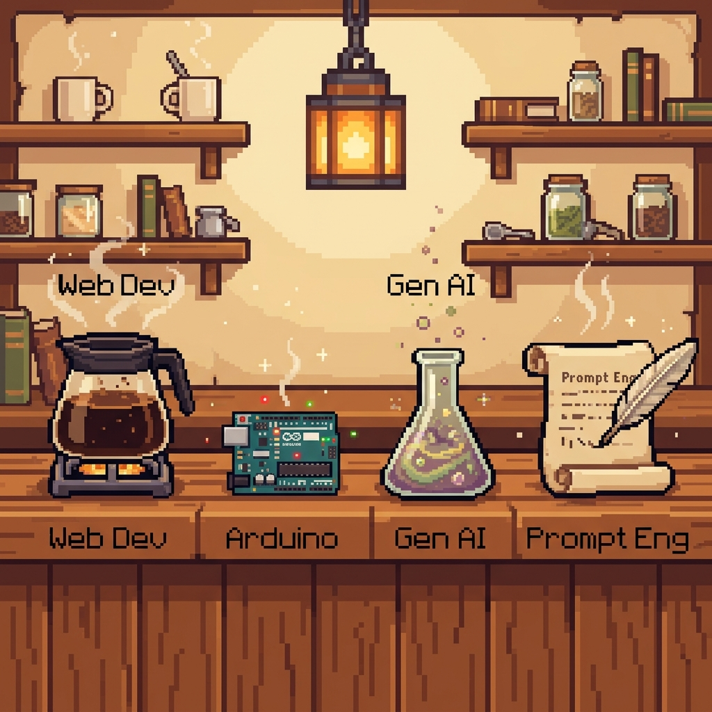

<br/><br/>

<table>
<tr>
<td align="center" width="25%">
<b>🌐 Web Development</b><br/>
<sub>HTML, CSS, JS and<br/>the chaotic magic<br/>of building for browsers.</sub>
</td>
<td align="center" width="25%">
<b>⚡ Arduino</b><br/>
<sub>Microcontrollers,<br/>circuits, and making<br/>things actually do things.</sub>
</td>
<td align="center" width="25%">
<b>✨ Generative AI</b><br/>
<sub>Language models, APIs,<br/>and what happens when<br/>you give AI a task.</sub>
</td>
<td align="center" width="25%">
<b>🪶 Prompt Engineering</b><br/>
<sub>The craft of talking<br/>to AI well. More nuanced<br/>than it sounds.</sub>
</td>
</tr>
</table>

<br/>


</div>

<br/>

<div align="center">

</div>

<br/>

<!-- ═══════════════════════════════════════════════════ -->
<!--      🧰  M Y   T O O L B O X                       -->
<!-- ═══════════════════════════════════════════════════ -->

<div align="center" id="toolbox">

<h2>🧰 &nbsp; My Toolbox</h2>

<p><i>The cafe's big chalkboard — everything I've put on the shelf so far.</i></p>

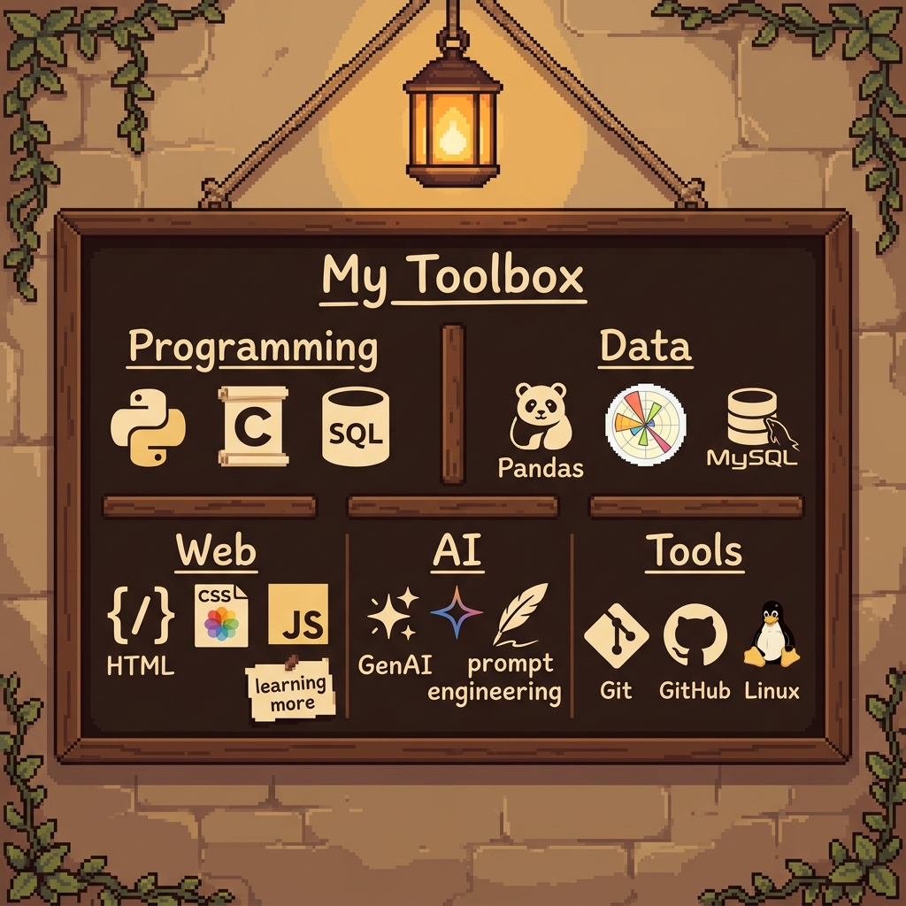

<br/><br/>

<h3>🐍 Programming</h3>


<h3>📊 Data and Visualization</h3>


<h3>🌐 Web</h3>


<h3>✨ AI</h3>


<h3>🛠️ Tools</h3>


</div>

<br/>

<div align="center">

</div>

<br/>

<!-- ═══════════════════════════════════════════════════ -->
<!--   ⭐  F E A T U R E D   B U I L D                  -->
<!-- ═══════════════════════════════════════════════════ -->

<div align="center" id="featured">

<h2>⭐ &nbsp; Featured Build</h2>

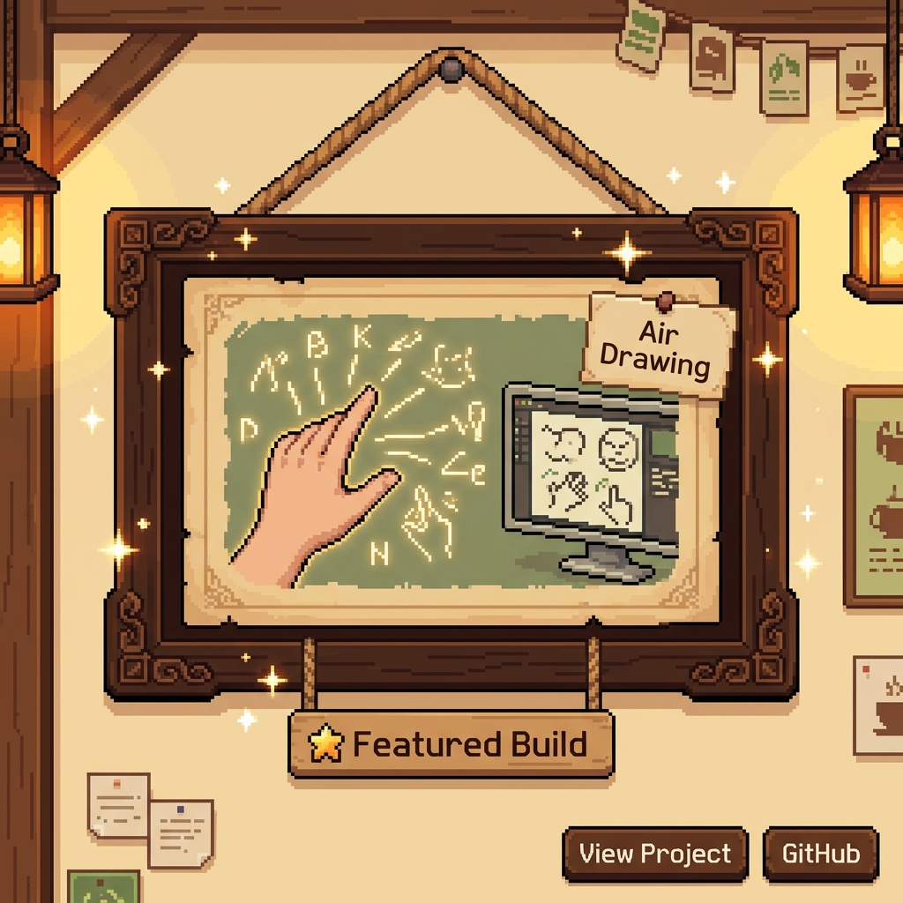

<br/><br/>

<table>
<tr>
<td align="center">


<br/><br/>

**Air Drawing** is a computer vision project that lets you draw, write, and sketch in mid-air using just your hand and a webcam. Using real-time hand gesture detection, it tracks your fingertip's movement and translates it into strokes on screen — no stylus, no touchscreen, just your hand in space. Point, move, and create. It's part drawing tool, part magic trick.

<br/>

**Built with:** `Python` · `OpenCV` · `MediaPipe` · `NumPy`

<br/>

[](https://github.com/keerthana-exe/air-drawing)
&nbsp;&nbsp;
[](https://github.com/keerthana-exe/air-drawing)

</td>
</tr>
</table>

</div>

<br/>

<div align="center">

</div>

<br/>

<!--      📓  C A F E   J O U R N A L                   -->
<!-- ═══════════════════════════════════════════════════ -->

<div align="center" id="journal">

<h2>📓 &nbsp; From the Cafe Journal</h2>

<p><i>What's been going on in the workshop lately.</i></p>

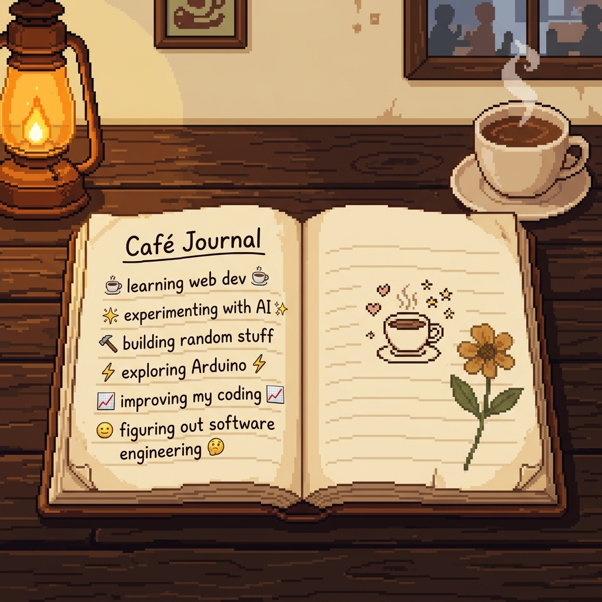

<br/><br/>

<table>
<tr>
<td align="left" width="100%">

```
📅 Recent journal entries
─────────────────────────────────────────────

☕  learning web development — it's like
    furniture assembly with no instructions

✨  experimenting with AI — asking models
    weird questions and seeing what sticks

🔨  building projects — the "I have no idea
    if this will work" phase is my favourite

⚡  exploring Arduino — turns out hardware
    is just software you can physically drop

📈  improving my coding — slowly, steadily,
    one confused bug at a time

🤔  figuring out software engineering —
    still figuring it out, honestly

─────────────────────────────────────────────
(more entries pending. coffee in progress.)
```

</td>
</tr>
</table>

</div>

<br/>

<div align="center">

</div>

<br/>

<!-- ═══════════════════════════════════════════════════ -->
<!--      🏷️  B E Y O N D   C O D E                     -->
<!-- ═══════════════════════════════════════════════════ -->

<div align="center" id="beyond">

<h2>🏷️ &nbsp; Beyond Code</h2>

<p><i>The cafe notice board — things that are not on a resume but matter anyway.</i></p>

</div>

<table align="center">
<tr>
<td align="left" valign="top" width="50%">

**💬 Communication**

The cafe is not just about the coffee — it's about the conversation.

- Explaining technical ideas to people who are not technical
- Presenting projects clearly and with confidence
- Collaborating with teammates across messy, real-world problems
- Finding the right words when "it just works" is not enough

</td>
<td align="left" valign="top" width="50%">

**🌟 Initiative and Teamwork**

Someone has to start brewing before the cafe opens.

- Taking the first step when nobody else wants to
- Coordinating moving parts across a project
- Working well in a team without needing to be in charge
- Turning a "what if we built..." into something you can actually click

</td>
</tr>
</table>

<br/>

<div align="center">

</div>

<br/>

<!-- ═══════════════════════════════════════════════════ -->
<!--   ✉️  C O N T A C T  /  C A F E   E X I T          -->
<!-- ═══════════════════════════════════════════════════ -->

<div align="center" id="contact">

<h2>✉️ &nbsp; Find Me Outside the Cafe</h2>

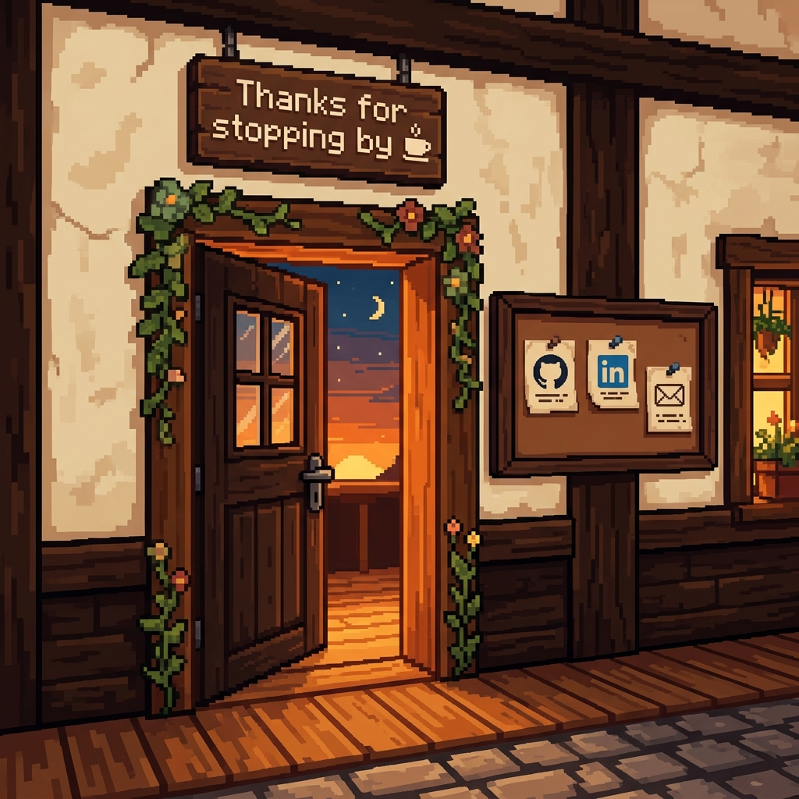

<br/><br/>

<p>Leave a note on the notice board. I read every one.</p>

<br/>

[](https://github.com/keerthana-exe)
&nbsp;&nbsp;
[](https://linkedin.com/in/keerthana-exe)
&nbsp;&nbsp;
[](mailto:your-email@example.com)

<br/><br/>


<br/>

```
╔═══════════════════════════════════════════════════╗
║                                                   ║
║         Thanks for stopping by.  ☕               ║
║                                                   ║
║    The cafe is always open. Come back anytime.    ║
║                                                   ║
╚═══════════════════════════════════════════════════╝
```

<br/>

<sub><i>Built by Keer · Pixel art generated with ☕ and way too much coffee · No neon was harmed in the making of this profile</i></sub>

</div>